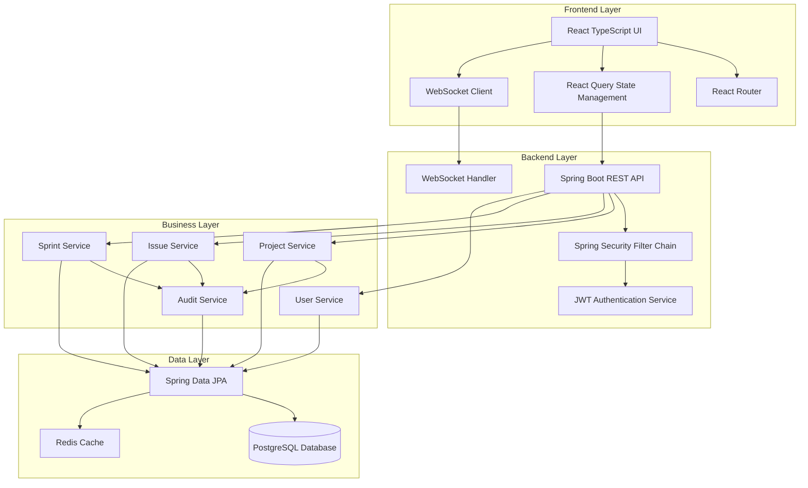
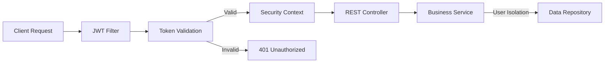
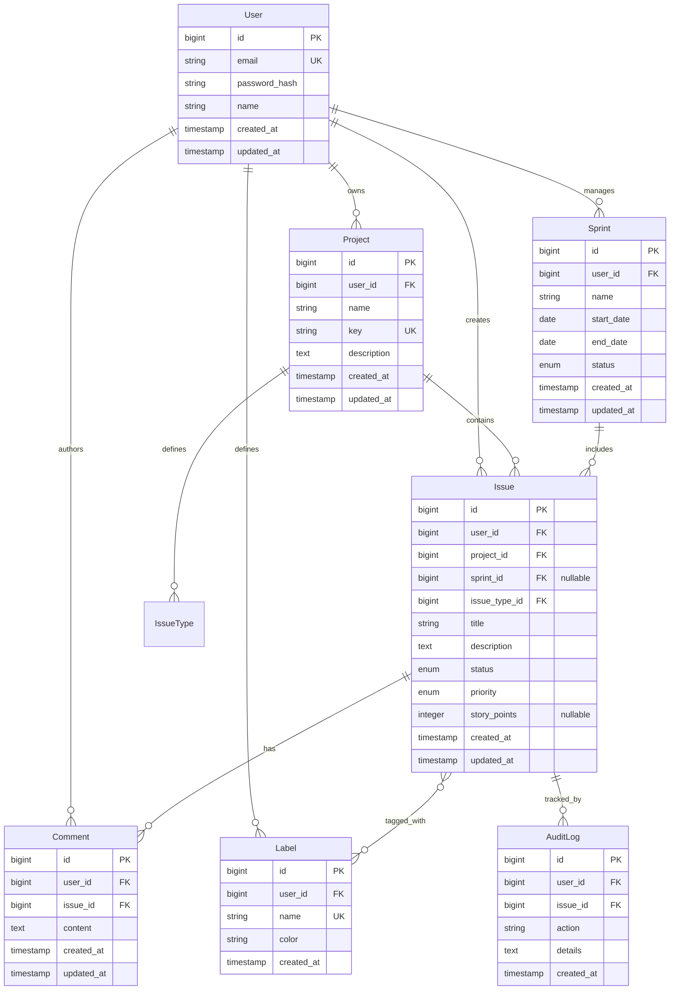

# Design Document: Personal Issue Tracker

## Overview

The Personal Issue Tracker is a full-stack web application built with modern technologies to provide a robust, scalable, and secure project management solution. The system follows a layered architecture with clear separation of concerns, implementing domain-driven design principles and ensuring data isolation per user.

The application consists of a Spring Boot backend providing RESTful APIs with JWT authentication, a PostgreSQL database for persistent storage, and a React TypeScript frontend with modern UI components. The system is designed to handle concurrent users while maintaining data integrity and providing real-time updates.

## Architecture

### System Architecture



### Security Architecture



## Components and Interfaces

### Backend Components

#### 1. Authentication and Security Layer

**JwtAuthenticationFilter**
- Intercepts all HTTP requests
- Extracts and validates JWT tokens from Authorization header
- Sets SecurityContext for authenticated users
- Implements rate limiting to prevent brute force attacks

**JwtService**
- Generates JWT tokens with user claims and expiration
- Validates token signatures using secret key
- Handles token refresh logic
- Implements secure token storage practices

**UserDetailsServiceImpl**
- Loads user details for authentication
- Integrates with Spring Security framework
- Provides user authorities and permissions

#### 2. REST API Controllers

**AuthController**
```java
@RestController
@RequestMapping("/api/auth")
public class AuthController {
    @PostMapping("/register")
    ResponseEntity<AuthResponse> register(@Valid RegisterRequest request);
    
    @PostMapping("/login") 
    ResponseEntity<AuthResponse> login(@Valid LoginRequest request);
    
    @PostMapping("/refresh")
    ResponseEntity<AuthResponse> refresh(@Valid RefreshRequest request);
}
```

**ProjectController**
```java
@RestController
@RequestMapping("/api/projects")
public class ProjectController {
    @GetMapping
    ResponseEntity<Page<ProjectDto>> getProjects(Pageable pageable);
    
    @PostMapping
    ResponseEntity<ProjectDto> createProject(@Valid CreateProjectRequest request);
    
    @PutMapping("/{id}")
    ResponseEntity<ProjectDto> updateProject(@PathVariable Long id, @Valid UpdateProjectRequest request);
    
    @DeleteMapping("/{id}")
    ResponseEntity<Void> deleteProject(@PathVariable Long id);
}
```

**IssueController**
```java
@RestController
@RequestMapping("/api/issues")
public class IssueController {
    @GetMapping
    ResponseEntity<Page<IssueDto>> getIssues(@RequestParam Map<String, String> filters, Pageable pageable);
    
    @PostMapping
    ResponseEntity<IssueDto> createIssue(@Valid CreateIssueRequest request);
    
    @PutMapping("/{id}")
    ResponseEntity<IssueDto> updateIssue(@PathVariable Long id, @Valid UpdateIssueRequest request);
    
    @PutMapping("/{id}/status")
    ResponseEntity<IssueDto> updateIssueStatus(@PathVariable Long id, @Valid StatusUpdateRequest request);
    
    @GetMapping("/{id}/history")
    ResponseEntity<List<AuditLogDto>> getIssueHistory(@PathVariable Long id);
}
```

#### 3. Business Service Layer

**ProjectService**
- Manages project CRUD operations with user isolation
- Validates project keys for uniqueness within user scope
- Handles project deletion with cascade operations
- Implements soft delete for data recovery

**IssueService**
- Manages issue lifecycle and workflow transitions
- Validates business rules for status changes
- Handles bulk operations with transaction management
- Implements search and filtering capabilities

**SprintService**
- Manages sprint planning and execution
- Validates sprint dates and capacity constraints
- Handles issue assignment and sprint completion
- Calculates sprint metrics and progress

**AuditService**
- Records all entity changes with detailed metadata
- Provides immutable audit trail
- Supports audit log querying and filtering
- Implements efficient storage for large audit datasets

#### 4. Data Access Layer

**Entity Models with JPA Annotations**
```java
@Entity
@Table(name = "issues", indexes = {
    @Index(name = "idx_issue_user_project", columnList = "user_id, project_id"),
    @Index(name = "idx_issue_status", columnList = "status"),
    @Index(name = "idx_issue_priority", columnList = "priority"),
    @Index(name = "idx_issue_sprint", columnList = "sprint_id")
})
public class Issue {
    @Id
    @GeneratedValue(strategy = GenerationType.IDENTITY)
    private Long id;
    
    @ManyToOne(fetch = FetchType.LAZY)
    @JoinColumn(name = "user_id", nullable = false)
    private User user;
    
    @ManyToOne(fetch = FetchType.LAZY)
    @JoinColumn(name = "project_id", nullable = false)
    private Project project;
    
    @Enumerated(EnumType.STRING)
    @Column(nullable = false)
    private IssueStatus status;
    
    @Enumerated(EnumType.STRING)
    @Column(nullable = false)
    private Priority priority;
    
    // Additional fields with proper validation annotations
}
```

### Frontend Components

#### 1. Application Structure

```
src/
├── components/           # Reusable UI components
│   ├── ui/              # Basic UI elements (Button, Input, Modal)
│   ├── forms/           # Form components with validation
│   └── layout/          # Layout components (Header, Sidebar, Footer)
├── features/            # Feature-based organization
│   ├── auth/            # Authentication components and hooks
│   ├── projects/        # Project management components
│   ├── issues/          # Issue management components
│   ├── sprints/         # Sprint management components
│   └── dashboard/       # Dashboard and reporting components
├── hooks/               # Custom React hooks
├── services/            # API service layer
├── types/               # TypeScript type definitions
├── utils/               # Utility functions
└── stores/              # State management (React Query)
```

#### 2. Key React Components

**AuthProvider**
- Manages authentication state globally
- Handles token storage and refresh
- Provides authentication context to child components

**IssueKanbanBoard**
- Implements drag-and-drop functionality for issue status changes
- Real-time updates via WebSocket connections
- Optimistic UI updates with rollback on failure

**SprintPlanningView**
- Interactive sprint planning interface
- Issue capacity estimation and validation
- Sprint goal setting and tracking

#### 3. State Management with React Query

```typescript
// Custom hooks for data fetching and mutations
export const useProjects = () => {
  return useQuery({
    queryKey: ['projects'],
    queryFn: () => projectService.getProjects(),
    staleTime: 5 * 60 * 1000, // 5 minutes
  });
};

export const useCreateIssue = () => {
  const queryClient = useQueryClient();
  
  return useMutation({
    mutationFn: (data: CreateIssueRequest) => issueService.createIssue(data),
    onSuccess: () => {
      queryClient.invalidateQueries({ queryKey: ['issues'] });
      queryClient.invalidateQueries({ queryKey: ['projects'] });
    },
  });
};
```

## Data Models

### Core Entity Relationships



### Database Optimization Strategy

**Indexing Strategy**
- Composite indexes on frequently queried columns (user_id + project_id, user_id + status)
- Single column indexes on foreign keys and enum fields
- Partial indexes for active sprints and recent issues
- Full-text search indexes for issue titles and descriptions

**Query Optimization**
- Use of @Query annotations for complex queries
- Fetch strategies optimized for specific use cases (LAZY vs EAGER)
- Pagination implementation for all list operations
- Query result caching for frequently accessed data

**Connection Pool Configuration**
```yaml
spring:
  datasource:
    hikari:
      maximum-pool-size: 20
      minimum-idle: 5
      connection-timeout: 20000
      idle-timeout: 300000
      max-lifetime: 1200000
```

## Correctness Properties

*A property is a characteristic or behavior that should hold true across all valid executions of a system—essentially, a formal statement about what the system should do. Properties serve as the bridge between human-readable specifications and machine-verifiable correctness guarantees.*

Now I need to analyze the acceptance criteria to determine which ones can be tested as properties:

### Property 1: User Data Isolation
*For any* authenticated user and any data operation (read, write, update, delete), the system should only allow access to data owned by that user, ensuring complete data isolation between users.
**Validates: Requirements 1.3, 1.5, 2.3, 2.4, 3.4, 4.3, 5.5, 6.4, 8.4**

### Property 2: Authentication Token Management
*For any* valid user credentials, the authentication service should generate a valid JWT token, and for any invalid credentials, authentication should be rejected with appropriate error messages.
**Validates: Requirements 1.2, 1.4**

### Property 3: User Registration with Encryption
*For any* valid email and password combination, user registration should create a new account with properly encrypted password that cannot be retrieved in plain text.
**Validates: Requirements 1.1, 9.2**

### Property 4: Project Management Lifecycle
*For any* project operations (create, update, delete), the system should maintain referential integrity, generate unique project keys, and properly handle cascade operations for associated issues.
**Validates: Requirements 2.1, 2.5**

### Property 5: Issue Workflow Integrity
*For any* issue status transition, the system should only allow valid workflow progressions (BACKLOG → SELECTED_FOR_DEVELOPMENT → IN_PROGRESS → IN_REVIEW → DONE) and record all changes in the audit trail.
**Validates: Requirements 3.3, 7.1**

### Property 6: Input Validation Consistency
*For any* user input across all entities (projects, issues, sprints, labels, comments), the system should validate data according to defined constraints and reject invalid inputs with appropriate error messages.
**Validates: Requirements 2.2, 3.2, 3.5, 4.1, 5.2, 6.5, 9.1**

### Property 7: Sprint Management Rules
*For any* sprint operations, the system should enforce business rules including date validation, single active sprint per user, and proper issue movement during sprint completion.
**Validates: Requirements 4.1, 4.2, 4.4, 4.5**

### Property 8: Label Management Scope
*For any* label operations, the system should ensure name uniqueness within user scope, allow cross-project usage, and properly handle deletion without affecting issue data integrity.
**Validates: Requirements 5.1, 5.3, 5.4**

### Property 9: Comment System Integrity
*For any* comment operations, the system should maintain proper user association, chronological ordering, and authorization for deletion while ensuring users can only comment on accessible issues.
**Validates: Requirements 6.1, 6.2, 6.3**

### Property 10: Audit Trail Completeness
*For any* tracked entity changes, the audit service should create immutable records with complete metadata (previous value, new value, user, timestamp) and provide chronological ordering for history queries.
**Validates: Requirements 7.2, 7.3, 7.4, 7.5**

### Property 11: Metrics and Reporting Accuracy
*For any* dashboard or report generation, the system should calculate metrics accurately based on current data state and ensure data isolation for the requesting user.
**Validates: Requirements 8.1, 8.2, 8.3**

### Property 12: Security Hardening
*For any* API access, the system should require valid JWT tokens for protected endpoints, prevent SQL injection through parameterized queries, and return consistent error responses without exposing sensitive information.
**Validates: Requirements 9.3, 9.4, 9.5**

### Property 13: Automatic Timestamping
*For any* entity creation or modification, the system should automatically set and update timestamps without manual intervention.
**Validates: Requirements 3.6**

### Property 14: Unique Identifier Generation
*For any* entity creation (issues, projects, users), the system should generate unique identifiers that remain unique across the entire system.
**Validates: Requirements 3.1**

## Error Handling

### Global Exception Handling Strategy

The system implements a comprehensive error handling strategy using Spring Boot's `@ControllerAdvice` to ensure consistent error responses across all endpoints.

**Exception Hierarchy**
```java
@ControllerAdvice
public class GlobalExceptionHandler {
    
    @ExceptionHandler(ValidationException.class)
    public ResponseEntity<ErrorResponse> handleValidation(ValidationException ex) {
        return ResponseEntity.badRequest()
            .body(ErrorResponse.builder()
                .code("VALIDATION_ERROR")
                .message("Input validation failed")
                .details(ex.getFieldErrors())
                .timestamp(Instant.now())
                .build());
    }
    
    @ExceptionHandler(UnauthorizedException.class)
    public ResponseEntity<ErrorResponse> handleUnauthorized(UnauthorizedException ex) {
        return ResponseEntity.status(HttpStatus.UNAUTHORIZED)
            .body(ErrorResponse.builder()
                .code("UNAUTHORIZED")
                .message("Authentication required")
                .timestamp(Instant.now())
                .build());
    }
    
    @ExceptionHandler(ForbiddenException.class)
    public ResponseEntity<ErrorResponse> handleForbidden(ForbiddenException ex) {
        return ResponseEntity.status(HttpStatus.FORBIDDEN)
            .body(ErrorResponse.builder()
                .code("FORBIDDEN")
                .message("Access denied")
                .timestamp(Instant.now())
                .build());
    }
}
```

**Error Response Format**
```json
{
  "code": "VALIDATION_ERROR",
  "message": "Input validation failed",
  "details": {
    "field": "email",
    "error": "Invalid email format"
  },
  "timestamp": "2024-01-15T10:30:00Z",
  "path": "/api/users/register"
}
```

### Business Logic Error Handling

**Workflow Validation Errors**
- Invalid status transitions return specific error codes
- Constraint violations provide detailed field-level feedback
- Business rule violations include context for resolution

**Data Integrity Errors**
- Foreign key constraint violations are caught and translated to user-friendly messages
- Optimistic locking conflicts trigger retry mechanisms
- Cascade operation failures are handled with transaction rollback

### Frontend Error Handling

**Error Boundary Implementation**
```typescript
class ErrorBoundary extends React.Component {
  constructor(props) {
    super(props);
    this.state = { hasError: false, error: null };
  }
  
  static getDerivedStateFromError(error) {
    return { hasError: true, error };
  }
  
  componentDidCatch(error, errorInfo) {
    console.error('Application error:', error, errorInfo);
    // Send error to monitoring service
  }
  
  render() {
    if (this.state.hasError) {
      return <ErrorFallback error={this.state.error} />;
    }
    return this.props.children;
  }
}
```

**API Error Handling with React Query**
```typescript
const useCreateIssue = () => {
  return useMutation({
    mutationFn: createIssue,
    onError: (error: ApiError) => {
      if (error.code === 'VALIDATION_ERROR') {
        toast.error(`Validation failed: ${error.details.field}`);
      } else if (error.code === 'UNAUTHORIZED') {
        // Redirect to login
        navigate('/login');
      } else {
        toast.error('An unexpected error occurred');
      }
    }
  });
};
```

## Testing Strategy

### Dual Testing Approach

The system implements both unit testing and property-based testing to ensure comprehensive coverage and correctness validation.

**Unit Tests**
- Focus on specific examples, edge cases, and error conditions
- Test individual components and integration points
- Validate concrete scenarios and boundary conditions
- Use JUnit 5 for backend and Jest/React Testing Library for frontend

**Property-Based Tests**
- Verify universal properties across all inputs through randomization
- Test business rules and invariants with generated data
- Ensure correctness properties hold for large input spaces
- Use QuickTheories for Java and fast-check for TypeScript
- Minimum 100 iterations per property test for thorough coverage

### Backend Testing Configuration

**Unit Testing with Spring Boot**
```java
@SpringBootTest
@Testcontainers
class IssueServiceTest {
    
    @Container
    static PostgreSQLContainer<?> postgres = new PostgreSQLContainer<>("postgres:15")
            .withDatabaseName("testdb")
            .withUsername("test")
            .withPassword("test");
    
    @Test
    void shouldCreateIssueWithValidData() {
        // Specific example test
        CreateIssueRequest request = CreateIssueRequest.builder()
            .title("Test Issue")
            .description("Test Description")
            .priority(Priority.MEDIUM)
            .projectId(1L)
            .build();
            
        IssueDto result = issueService.createIssue(request, user);
        
        assertThat(result.getTitle()).isEqualTo("Test Issue");
        assertThat(result.getStatus()).isEqualTo(IssueStatus.BACKLOG);
    }
}
```

**Property-Based Testing Example**
```java
@Property
void issueWorkflowTransitionsAreValid(@ForAll("validIssues") Issue issue, 
                                     @ForAll("validStatusTransitions") IssueStatus newStatus) {
    // Feature: personal-issue-tracker, Property 5: Issue Workflow Integrity
    
    if (isValidTransition(issue.getStatus(), newStatus)) {
        IssueDto updated = issueService.updateStatus(issue.getId(), newStatus, user);
        assertThat(updated.getStatus()).isEqualTo(newStatus);
        
        // Verify audit trail is created
        List<AuditLog> auditLogs = auditService.getIssueHistory(issue.getId());
        assertThat(auditLogs).isNotEmpty();
        assertThat(auditLogs.get(0).getAction()).contains("STATUS_CHANGE");
    } else {
        assertThatThrownBy(() -> issueService.updateStatus(issue.getId(), newStatus, user))
            .isInstanceOf(InvalidWorkflowTransitionException.class);
    }
}

@Provide
Arbitrary<Issue> validIssues() {
    return Combinators.combine(
        Arbitraries.strings().withCharRange('a', 'z').ofMinLength(1).ofMaxLength(100),
        Arbitraries.of(Priority.class),
        Arbitraries.of(IssueStatus.class)
    ).as((title, priority, status) -> 
        Issue.builder()
            .title(title)
            .priority(priority)
            .status(status)
            .user(testUser)
            .project(testProject)
            .build()
    );
}
```

### Frontend Testing Configuration

**Component Testing with React Testing Library**
```typescript
describe('IssueForm', () => {
  it('should validate required fields', async () => {
    render(<IssueForm onSubmit={mockSubmit} />);
    
    const submitButton = screen.getByRole('button', { name: /create issue/i });
    fireEvent.click(submitButton);
    
    expect(await screen.findByText(/title is required/i)).toBeInTheDocument();
    expect(await screen.findByText(/project is required/i)).toBeInTheDocument();
  });
});
```

**Property-Based Testing for Frontend**
```typescript
import fc from 'fast-check';

describe('Issue validation properties', () => {
  it('should reject invalid issue data', () => {
    // Feature: personal-issue-tracker, Property 6: Input Validation Consistency
    
    fc.assert(fc.property(
      fc.record({
        title: fc.string(),
        description: fc.string(),
        priority: fc.constantFrom('LOW', 'MEDIUM', 'HIGH', 'CRITICAL', 'INVALID'),
        storyPoints: fc.integer()
      }),
      (issueData) => {
        const validation = validateIssueData(issueData);
        
        if (issueData.title.trim() === '') {
          expect(validation.errors).toContain('Title is required');
        }
        
        if (issueData.priority === 'INVALID') {
          expect(validation.errors).toContain('Invalid priority value');
        }
        
        if (issueData.storyPoints < 0) {
          expect(validation.errors).toContain('Story points must be non-negative');
        }
      }
    ), { numRuns: 100 });
  });
});
```

### Integration Testing Strategy

**API Integration Tests**
- Test complete request/response cycles
- Validate authentication and authorization flows
- Test error handling and edge cases
- Use Testcontainers for database integration

**End-to-End Testing**
- Test critical user workflows
- Validate frontend-backend integration
- Test real-time features (WebSocket connections)
- Use Playwright or Cypress for browser automation

### Performance Testing

**Load Testing Configuration**
- Test concurrent user scenarios
- Validate database performance under load
- Monitor memory usage and connection pools
- Use JMeter or k6 for load generation

**Database Performance Testing**
- Query execution time monitoring
- Index effectiveness validation
- Connection pool optimization
- Slow query identification and optimization